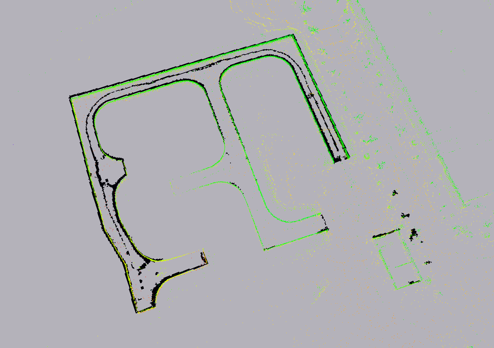

# 基于 [ pointcloud_to_grid ](https://github.com/jkk-research/pointcloud_to_grid) 修改

# 效果图




# 使用步骤
```bash
mkdir -p ~/pointcloud_to_grid/src
cd ~/pointcloud_to_grid/src
git clone git@github.com:zylyehuo/pointcloud_to_grid.git
```
```bash
# 获取二维栅格地图的参数
# 运行脚本后播放 bag 数据
cd ~/pointcloud_to_grid/src/pointcloud_to_grid/scripts
python3 cloud_bounds.py
```
```bash
# 输出格式如下：
zylyehuo@thinkpad:~/mapping/pointcloud_to_grid/src/pointcloud_to_grid/scripts$ python3 cloud_bounds.py 
frame: hesai_lidar
points: 64000
x min/max: -51.76988983154297 137.8656463623047
y min/max: -81.10433959960938 55.91629409790039
z min/max: -1.4742575883865356 9.958451271057129
suggest position_x: 43.04787826538086
suggest position_y: -12.594022750854492
suggest length_x: 194.63553619384766
suggest length_y: 142.02063369750977

```
```bash
# 搭配定位程序使用，订阅定位程序输出的点云话题
# ctrl+c 会自动保存地图【默认是在工作空间根目录下】
cd ~/pointcloud_to_grid
source install/setup.bash
ros2 launch pointcloud_to_grid demo.launch.py topic:=<定位程序输出的点云话题>
```
```bash
cd ~/pointcloud_to_grid
source install/setup.bash
ros2 launch pointcloud_to_grid rviz.launch.py
```
```bash
# 发布构建的二维栅格地图
cd ~/pointcloud_to_grid
source install/setup.bash
ros2 launch pointcloud_to_grid map_server.launch.py
```
